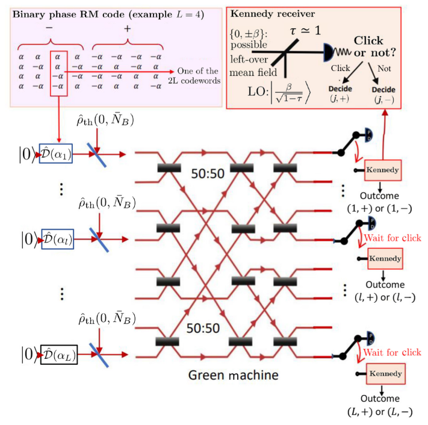

# mlpolar-ppm

Multi-level polar coding for L-ary pulse-position modulation (PPM) with photon-detection receivers, targeting the Lattice iCE40 FPGA. Includes a Python design tool for channel analysis and frozen-set generation, and a complete SystemVerilog RTL implementation with a build toolchain.

---

## Table of Contents

- [Background](#background)
- [Repository Structure](#repository-structure)
- [Quick Start](#quick-start)
- [Channel Model](#channel-model)
- [Theory: K-SBP and Multi-Level Polar Coding](#theory-k-sbp-and-multi-level-polar-coding)
- [Python Design Tool (`scripts/mlpolar_design.py`)](#python-design-tool)
- [SystemVerilog Modules](#systemverilog-modules)
  - [`rtl/pkg_mlpolar.sv`](#rtlpkg_mlpolarsv)
  - [`rtl/polar_encoder.sv`](#rtlpolar_encodersv)
  - [`rtl/ppm_llr_compute.sv`](#rtlppm_llr_computesv)
  - [`rtl/polar_decoder_sc.sv`](#rtlpolar_decoder_scsv)
  - [`rtl/msd_controller.sv`](#rtlmsd_controllersv)
  - [`rtl/ml_polar_top.sv`](#rtlml_polar_topsv)
- [Testbench](#testbench)
- [Build Workflow: SV → Yosys → nextpnr → iceprog](#build-workflow)
- [Resource Estimates](#resource-estimates)
- [Regenerating Frozen Sets](#regenerating-frozen-sets)
- [References](#references)

---

## Background

This project implements a capacity-achieving multi-level (ML) polar code for the classical channel induced by coherent-state L-PPM modulation with a photon-counting receiver. The physical setup is:

- **Transmitter**: coherent state L-PPM (equivalently, block-length-L Hadamard-encoded BPSK)
- **Receiver**: Green Machine (Hadamard stage) followed by photon detection on each pulse-position mode

The resulting classical channel has a 1024-ary input and a 1025-ary output (1024 slots + erasure). A 10-level binary sequential partition (K-SBP) of the input alphabet decomposes channel capacity into 10 binary sub-channels, each coded with a length-256 polar component code. The decoder performs multi-stage decoding (MSD), using each decoded level as side information for the next.

---

## Repository Structure

```
mlpolar-ppm/
│
├── README.md
│
├── scripts/
│   └── mlpolar_design.py       # Channel analysis + frozen-set generation
│
├── rtl/
│   ├── pkg_mlpolar.sv          # Parameters package (frozen masks, LLR types)
│   ├── polar_encoder.sv        # N=256 polar encoder (butterfly network)
│   ├── ppm_llr_compute.sv      # PPM bit-level LLR computation for MSD
│   ├── polar_decoder_sc.sv     # Successive cancellation (SC) decoder
│   ├── msd_controller.sv       # Multi-stage decoding orchestrator
│   └── ml_polar_top.sv         # Top-level + board wrapper (iCEBreaker)
│
├── tb/
│   └── tb_mlpolar.sv           # SystemVerilog testbench with channel simulation
│
├── constraints/
│   └── mlpolar_ppm.pcf         # iCEBreaker pin constraints (iCE40UP5K-SG48)
│
└── build/                      # Generated by build.sh (gitignored)
    ├── *.json                  # Yosys netlists
    ├── *.asc                   # nextpnr ASCII bitstreams
    └── *.bin                   # Packed binary bitstreams
```

---

## Quick Start

### Python design tool (no hardware required)

```bash
pip install numpy scipy
python scripts/mlpolar_design.py
```

Prints bit-channel capacities, Bhattacharyya parameters, frozen sets, and the `FROZEN_MASK` block ready to paste into `rtl/pkg_mlpolar.sv`.

### FPGA build

```bash
# Install OSS CAD Suite (yosys + nextpnr-ice40 + icestorm + iverilog)
curl -L https://github.com/YosysHQ/oss-cad-suite-build/releases/latest/download/\
oss-cad-suite-linux-x64-latest.tgz | tar xz
source oss-cad-suite/environment

# Simulate, synthesise, place-and-route, pack, and program
./build.sh all
```

Individual steps: `./build.sh sim | synth | pnr | pack | program | timing | clean`

---

## Channel Model

The L-ary PPM + photon-detection channel has transition matrix:

```
W(y | x)  =  p              if y == x         (correct detection)
          =  q              if y == L          (erasure: photon lost)
          =  (1-p-q)/(L-1)  otherwise          (wrong slot / dark count)
```

where `x ∈ {0,...,L-1}` is the transmitted slot and `y ∈ {0,...,L}` is the received symbol (`y=L` denotes erasure).

Default parameters: **K=10, L=1024, p=0.7, q=0.05**, giving channel capacity **I(X;Y) = 6.210 bits/channel use**.

This channel is subsumed (via transmission over only half of the RM codebook) by the classical channel induced by the quantum coherent state modulation and Green-Machine-photon-detection circuit analyzed by Cox et al. in PhysRevApplied.19.064015, shown below
<!------>


---

## Theory: K-SBP and Multi-Level Polar Coding

### Binary Sequential Partition (K-SBP)

A K-SBP under the SP (set-partitioning / natural-binary) labeling maps slot index `x` to its K-bit binary representation `(b₀, b₁, ..., b_{K-1})` (MSB first). This defines K nested balanced binary partitions of the input alphabet:

- **Level i** splits every cell of P_i into two equal halves by bit `b_i`.
- Each cell of P_i contains exactly `2^(K-i)` inputs.

This is a valid K-SBP because the SP labeling is a bijection, so the chain rule gives:

```
Σ_{i=0}^{K-1} I(B^(i)_λ) = I(X; Y)
```

with no capacity loss at any level.

### Bit-channel capacities

The capacity of the i-th bit channel (Seidl et al. eq. 4) is the conditional mutual information:

```
I(B^(i)_λ) = I(b_i ; Y | b_0, ..., b_{i-1})
```

For K=10, p=0.7, q=0.05:

| Level | I(B^i) [bits] | Z(B^i) | K_info (N=256) | Frozen |
|-------|--------------|--------|----------------|--------|
| 0     | 0.4160       | 0.6925 | 106            | 150    |
| 1     | 0.5054       | 0.6119 | 129            | 127    |
| 2     | 0.5740       | 0.5401 | 147            | 109    |
| 3     | 0.6220       | 0.4805 | 159            |  97    |
| 4     | 0.6532       | 0.4334 | 167            |  89    |
| 5     | 0.6726       | 0.3973 | 172            |  84    |
| 6     | 0.6842       | 0.3704 | 175            |  81    |
| 7     | 0.6910       | 0.3507 | 177            |  79    |
| 8     | 0.6949       | 0.3363 | 178            |  78    |
| 9     | 0.6971       | 0.3259 | 178            |  78    |
| **Σ** | **6.2105**   |        | **1588**       | **972**|

### Multi-level polar coding and MSD

A length-N=256 binary polar code is constructed for each bit channel B^(i)_λ at rate R_i = I(B^(i)_λ). The frozen set at each level is found by applying Arikan's Bhattacharyya density evolution to N copies of B^(i)_λ.

Multi-stage decoding (MSD) proceeds sequentially from level 0 to 9: the SC decoder at level i receives LLRs conditioned on all previously decoded bits `b_0,...,b_{i-1}`, which are used as side information in the LLR computation for level i+1.

---

## Python Design Tool

**`scripts/mlpolar_design.py`**

Self-contained module with no dependencies beyond NumPy. Run directly to reproduce the table above and generate the `FROZEN_MASK` block for `pkg_mlpolar.sv`.

### Public API

```python
from mlpolar_design import (
    ppm_channel,               # build W(y|x) transition matrix
    ksbp_transition_matrices,  # transition matrices of all K bit channels B^(i)_λ
    bit_channel_capacities,    # I(B^(i)_λ) for i=0..K-1
    bit_channel_bhattacharyya, # Z(B^(i)_λ) for i=0..K-1
    compute_frozen_sets,       # frozen/info index sets + K_info counts
    frozen_masks_as_int,       # convert frozen sets to 256-bit integer masks
    print_sv_frozen_masks,     # print the SV localparam block
    design_report,             # full summary (calls all of the above)
)
```

#### `ppm_channel(K, p, q) → np.ndarray, shape (L, L+1)`
Builds the transition matrix for the L=2^K PPM channel with correct-detection probability `p` and erasure probability `q`.

#### `ksbp_transition_matrices(K, p, q) → list of K np.ndarray`
Returns the stochastic transition matrices `M_i` of the K bit channels `B^(i)_λ` under the SP labeling. `M_i` has shape `(2, (L+1)·2^i)`: 2 rows for `b_i ∈ {0,1}` and `(L+1)·2^i` columns for the joint output `(Y, b_0,...,b_{i-1})`. Row sums are exactly 1.

#### `bit_channel_capacities(K, p, q) → list of K floats`
Computes `I(B^(i)_λ) = I(b_i ; Y | b_0,...,b_{i-1})` as a conditional mutual information, averaging over all `2^i` prefixes. The sum equals `I(X;Y)` by the chain rule (verified by assertion).

#### `bit_channel_bhattacharyya(K, p, q) → list of K floats`
Computes the exact Bhattacharyya parameter `Z(B^(i)_λ) = E_prefix[Σ_y √(P(y|b_i=0,prefix)·P(y|b_i=1,prefix))]` for each bit level.

#### `compute_frozen_sets(K, p, q, N=256) → (info_sets, frozen_sets, k_infos)`
For each bit level i:
1. Computes `Z(B^(i)_λ)` exactly.
2. Evolves it through `log2(N)` stages of Arikan's polar recursion using the upper bounds `Z(W⁻) ≤ 2Z − Z²`, `Z(W⁺) = Z²`.
3. Sets `K_info^(i) = round(I(B^(i)_λ) · N)` (capacity rule).
4. Selects the `K_info^(i)` most reliable (smallest Z) synthetic channels as information channels.

#### `design_report(K, p, q, N=256)`
Prints the full summary table and the `localparam logic [255:0] FROZEN_MASK ...` block for direct paste into `rtl/pkg_mlpolar.sv`.

---

## SystemVerilog Modules

### `rtl/pkg_mlpolar.sv`

**SystemVerilog package** imported by all other modules. Contains:

- `L`, `K_LEVELS`, `N`, `LOG2N`: top-level dimensions.
- `PROB_P`, `PROB_Q`: Q0.16 fixed-point channel parameters.
- `LLR_BITS`, `LLR_MAX`, `LLR_MIN`, `llr_t`: LLR quantization typedef.
- `K_INFO[0:9]`: number of information bits per component code level.
- `FROZEN_MASK[0:9]`: 256-bit frozen-channel masks, one per bit level. **Generated by `scripts/mlpolar_design.py`** using exact Bhattacharyya density evolution. See [Regenerating Frozen Sets](#regenerating-frozen-sets).

---

### `rtl/polar_encoder.sv`

**N=256 polar encoder.** Implements `c = u · G_N` where `G_N = B_N · F_2^{⊗8}` is Arikan's generator matrix.

**Architecture**: 8 registered butterfly stages, each performing the F₂ kernel:
```
x_out[2i]   = x_in[2i] XOR x_in[2i+1]   // check node  (worse channel)
x_out[2i+1] = x_in[2i+1]                 // copy node   (better channel)
```
applied with stride `2^(s-1)` at stage `s`. A combinational bit-reversal permutation B_N follows the last stage.

**Latency**: `LOG2N = 8` clock cycles (one registered stage per butterfly layer).

**Correspondence to MLC theory**: implements the N-SBP π^n for one component code (Seidl Sec. IV-B). Ten instances run in parallel, one per bit level. Their outputs are assembled into PPM slot indices by the SP labeling in `ml_polar_top.sv`.

**Input** `u[N-1:0]`: information bits placed at unfrozen positions, zeros at frozen positions.  
**Output** `c[N-1:0]`: polar codeword.

---

### `rtl/ppm_llr_compute.sv`

**Bit-level LLR computation for multi-stage decoding.** Computes the MSD log-likelihood ratio for bit level `current_level` given a single PPM observation and the decoded prefix from all previous levels.

**Theory**: under SP labeling and the PPM transition matrix, the LLR for bit `b_i` given observation `y` and decoded prefix `b_{0:i-1}` reduces to three cases:

| Condition | LLR |
|-----------|-----|
| Erasure (`y = L`) | 0 — symmetric over both halves |
| Prefix bits of `y` ≠ decoded prefix | 0 — `y` carries no information about `b_i` |
| Prefix matches, bit `b_i` of `y` = 0 | `+LLR_MAG[i]` (b_i=0 strongly favoured) |
| Prefix matches, bit `b_i` of `y` = 1 | `−LLR_MAG[i]` (b_i=1 strongly favoured) |

The magnitude `LLR_MAG[i] = round(log₂(p / (2^(K−i−1) · r)) · 4)` is precomputed for each level and stored as a ROM constant. This is a consequence of the dominant `p ≫ r` term in the transition probabilities.

**Pipeline depth**: 2 clock cycles (input register + output register).

---

### `rtl/polar_decoder_sc.sv`

**Successive Cancellation (SC) decoder** for N=256 polar codes, operating in the log-LLR domain.

**Algorithm**: SC decoding traverses the N-leaf binary tree, computing at each node either:

- **f-function** (check / XOR node — worse synthetic channel):
  ```
  f(a, b) = sign(a)·sign(b)·min(|a|, |b|)
  ```
  This is the min-sum approximation to the exact log-domain XOR combination. It computes the LLR of the left-branch (b₀) synthetic channel from the parent LLRs.

- **g-function** (copy / variable node — better synthetic channel):
  ```
  g(a, b, û) = b + (1 − 2û)·a
  ```
  This is exact (no approximation). It conditions on the already-decoded bit `û` to compute the LLR of the right-branch (b₁) synthetic channel.

The entire 8-stage LLR tree is instantiated as a `generate`-block combinational circuit (`SC_STAGE`, `SC_NODE`), so one leaf decision is produced per clock cycle. Total decode latency is N=256 clock cycles per codeword.

**Frozen channels**: at positions where `FROZEN[i] = 1`, the decision is forced to `û = 0` (the known frozen value) without consuming an information bit.

**Partial sums**: `partial_sum[N-1:0]` accumulates decisions bottom-up for use in g-function conditioning.

---

### `rtl/msd_controller.sv`

**Multi-stage decoding (MSD) orchestrator.** Implements the sequential decoding procedure of Seidl et al. Sec. IV-A, driving the LLR computation and SC decoder pipeline across all K=10 bit levels.

**State machine** (`MSD_IDLE → MSD_OBS_LOAD → MSD_LLR_COMP → MSD_SC_WAIT → MSD_NEXT_LVL → MSD_DONE`):

1. **OBS_LOAD**: buffer N=256 PPM observations from the input stream.
2. **LLR_COMP** (level i): feed each of the N buffered observations to `ppm_llr_compute` along with the current `decoded_prefix` (bits 0..i-1 already decided). This runs N cycles.
3. **SC_WAIT** (level i): the SC decoder processes all N LLRs and emits N decisions. Information bits are forwarded to the output; all N decisions (including frozen zeros) are written to `side_info_col[n][i]` for use as the decoded prefix at level i+1.
4. **NEXT_LVL**: advance `current_level` and repeat from step 2, or proceed to DONE after level K-1.

**Key data structure**: `side_info_col[n]` is a K-bit register per PPM symbol `n`, accumulating the decoded bits `b_0[n],...,b_{K-1}[n]` across levels. This implements the conditioning `I(b_i; Y | b_0,...,b_{i-1})` in hardware.

**Throughput**: 10 levels × 2×256 cycles/level = 5120 cycles/block (plus small overhead), giving approximately 7.5 Mbps at 24 MHz.

---

### `rtl/ml_polar_top.sv`

**Top-level integration module** for the full ML polar codec, plus a `top` wrapper module with iCEBreaker-specific I/O.

**Encoder path**:
1. 1588 info bits arrive serially and are demultiplexed into 10 level buffers of `K_INFO[i]` bits each.
2. Frozen zeros are inserted at the positions specified by `FROZEN_MASK[i]` to form the N=256 input vector `u` for each level.
3. Ten `polar_encoder` instances run in parallel, producing codewords `c_0,...,c_9`.
4. The SP labeling assembles the PPM slot index for symbol `n` as `{c_0[n], c_1[n], ..., c_9[n]}` (MSB = level 0).

**Decoder path**: delegated to `msd_controller`, which drives `ppm_llr_compute` and `polar_decoder_sc` sequentially across all 10 levels.

**Board wrapper** (`module top`): adds a soft SPI deserializer for encoder input, an 11-bit observation shift-in for decoder input, and connects to the iCEBreaker's PMOD pins and LEDs.

---

## Testbench

**`tb/tb_mlpolar.sv`**

Simulates 3 complete encode→channel→decode blocks:
1. Generates random 1588-bit info blocks.
2. Feeds bits to the encoder serially.
3. Captures N=256 PPM slot outputs, applies the stochastic PPM channel model (`$urandom`-based Monte Carlo), and streams observations to the decoder.
4. Compares decoded bits against the transmitted bits and reports BER.

Run with:
```bash
./build.sh sim
# or manually:
iverilog -g2012 -I rtl/ rtl/*.sv tb/tb_mlpolar.sv -o build/sim.vvp
vvp build/sim.vvp
gtkwave tb_mlpolar.vcd   # waveform inspection
```

---

## Build Workflow

The full toolchain is `SV → Yosys → nextpnr-ice40 → icepack → iceprog`.

```
scripts/mlpolar_design.py
         │  (offline, generates FROZEN_MASK)
         ▼
rtl/pkg_mlpolar.sv ──► rtl/*.sv ──┐
                                   │
                           ┌───────▼────────┐
                           │     Yosys      │  read_verilog -sv
                           │  synth_ice40   │  → proc, flatten, fsm,
                           │                │    techmap (SB_LUT4/SB_DFF),
                           │                │    abc, write_json
                           └───────┬────────┘
                                   │  build/*.json  (netlist)
                           ┌───────▼────────┐
                           │ nextpnr-ice40  │  --up5k --package sg48
                           │  placement     │  --freq 24 --placer heap
                           │  routing       │  --router router2
                           └───────┬────────┘
                                   │  build/*.asc  (ASCII bitstream)
                           ┌───────▼────────┐
                           │    icepack     │  .asc → .bin
                           └───────┬────────┘
                                   │  build/*.bin  (binary bitstream)
                           ┌───────▼────────┐
                           │    iceprog     │  FTDI → SPI flash
                           │  (iCEBreaker)  │  → iCE40 auto-reconfigures
                           └────────────────┘
```

**Yosys passes** (`synth_ice40`):
- `proc`: converts `always` blocks to RTL netlist
- `flatten`: inlines all module hierarchies
- `fsm`: extracts and re-encodes finite state machines
- `techmap`: maps generic cells to iCE40 primitives (`SB_LUT4`, `SB_DFF`, `SB_MAC16`)
- `abc`: logic optimisation and 4-input LUT packing via Berkeley ABC
- `ice40_opt`: iCE40-specific post-ABC cleanup

**nextpnr options**: `--placer heap` (analytic placement, better for dense designs), `--router router2` (congestion-aware router), `--freq 24` (24 MHz timing constraint). Seed can be varied with `--seed N` if timing closure fails.

---

## Resource Estimates

Target: iCE40UP5K-SG48 (5280 LUTs, 30 EBR BRAMs, 8 SB_MAC16 DSP blocks).

| Block | SB_LUT4 | EBR BRAMs | Notes |
|-------|---------|-----------|-------|
| 10× `polar_encoder` (shared) | ~800 | — | 8 XOR stages × 128 gates, pipelined |
| `polar_decoder_sc` (combinational LLR tree) | ~2000 | 1 | LLR RAM |
| `ppm_llr_compute` | ~100 | — | ROM + comparators |
| `msd_controller` + obs/side-info buffers | ~150 | 2 | side_info_col RAM |
| Top-level + SPI wrappers | ~100 | — | |
| **Total estimate** | **~3150** | **3** | **fits iCE40UP5K** |

---

## Regenerating Frozen Sets

**No, you do not need to manually edit `rtl/pkg_mlpolar.sv`** for the default parameters — the file already contains the correct Bhattacharyya-evolution frozen masks for K=10, p=0.7, q=0.05, N=256.

If you change any of K, p, q, or N:

```bash
python scripts/mlpolar_design.py   # prints updated FROZEN_MASK block
```

Copy the printed `localparam logic [255:0] FROZEN_MASK ...` block and replace the corresponding block in `rtl/pkg_mlpolar.sv`. You will also need to update `K_INFO[0:K_LEVELS-1]` with the new `K_info` values from the same output. No other files need to change for a parameter-only update.

---

## References
[1] A. Cox, Q. Zhuang, C. N. Gagagatsos, B. Bash, S. Guha, "Trancseiver designs approcing the Entanglement-Assisted Communications Capacity," *Phys. Rev. Applied*, vol 19, 064015 Jun 2023.

[2] M. Seidl, A. Schenk, C. Stierstorfer, J. B. Huber, "Polar-Coded Multi-Level Modulation," *IEEE Transactions on Communications*, vol. 61, no. 6, pp. 2211–2219, June 2013.

[3] E. Arikan, "Channel Polarization: A Method for Constructing Capacity-Achieving Codes for Symmetric Binary-Input Memoryless Channels," *IEEE Transactions on Information Theory*, vol. 55, no. 7, pp. 3051–3073, July 2009.

[4] Project IceStorm: https://github.com/YosysHQ/icestorm  
[5] Yosys Open SYnthesis Suite: https://github.com/YosysHQ/yosys  
[6] nextpnr FPGA place-and-route: https://github.com/YosysHQ/nextpnr  
[7] OSS CAD Suite (all tools bundled): https://github.com/YosysHQ/oss-cad-suite-build
